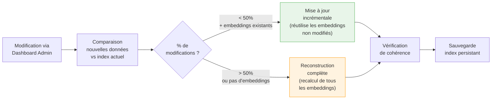

<p align="center">
  
</p>

<h1 align="center">OSI - Assistant Virtuel du Support Informatique</h1>

<p align="center">
  <strong>Chatbot intelligent basé sur RAG + LLM pour le support informatique du Ministère de l'Économie et des Finances</strong>
</p>

<p align="center">
  <a href="#fonctionnalités">Fonctionnalités</a> •
  <a href="#architecture">Architecture</a> •
  <a href="#installation">Installation</a> •
  <a href="#configuration">Configuration</a> •
  <a href="#api">API</a> •
  <a href="#déploiement">Déploiement</a>
</p>

---

## Description

**OSI** (Offre de Services Informatique) est un assistant virtuel conçu pour guider les utilisateurs dans le catalogue des services informatiques de l'Administration Centrale. Il utilise un système **RAG** (Retrieval-Augmented Generation) couplé à un **LLM** (Large Language Model) pour fournir des réponses contextualisées et pertinentes.

### Cas d'usage

- Rechercher une application ou un service informatique
- Obtenir des instructions d'utilisation
- Accéder aux tutoriels vidéo et documentation
- Naviguer dans le catalogue des services

---

## Fonctionnalités

### Interface utilisateur frontend
- Interface de chat interactive et intuitive
- Mode sombre/clair
- Design responsive (mobile et desktop)
- Affichage multimédia (images, vidéos)
- Boutons interactifs pour navigation guidée
- Évaluation des réponses du chatbot

### Tableau de bord administrateur
- Gestion de la base de connaissances RAG
- Visualisation des conversations
- Statistiques d'utilisation avec graphiques
- Système de backup et restauration
- Import/Export des données

### API Backend
- Recherche sémantique avec FAISS
- Génération de réponses via LLM (Olympia/Mistral)
- Historique des conversations (MongoDB)
- Synchronisation intelligente des embeddings
- WebSocket pour temps réel

---

## Architecture

```
osi/
├── api-chatbot-osi/           # Backend Python FastAPI
│   ├── app/
│   │   ├── api/routes/        # Endpoints REST
│   │   ├── services/          # Logique métier (RAG, LLM, MongoDB)
│   │   ├── models/            # Modèles Pydantic
│   │   └── config/            # Configuration
│   ├── tests/                 # Tests unitaires
│   └── data/                  # Base de connaissances
│
├── dashboard-chatbot-osi/     # Dashboard Admin (Next.js)
│   └── src/
│       ├── app/               # Pages et routes
│       ├── components/        # Composants React
│       └── lib/               # Utilitaires
│
└── frontend-chatbot-osi/      # Interface Utilisateur (Next.js)
    └── src/
        ├── app/               # Pages
        ├── components/        # Composants (chatbot, UI)
        └── context/           # Contextes React
```

### Flux de données

```
┌─────────────────┐     ┌─────────────────┐     ┌─────────────────┐
│    Frontend     │────▶│   API Backend   │────▶│    MongoDB      │
│   (Next.js)     │     │   (FastAPI)     │     │ (Conversations) │
└─────────────────┘     └────────┬────────┘     └─────────────────┘
                                 │
        ┌────────────────────────┼────────────────────────┐
        ▼                        ▼                        ▼
┌───────────────┐      ┌─────────────────┐      ┌─────────────────┐
│     FAISS     │      │  LLM (Olympia)  │      │   Embeddings    │
│ (Recherche)   │      │  (Génération)   │      │    (Solon)      │
└───────────────┘      └─────────────────┘      └─────────────────┘
```

---

## Prérequis

| Composant | Version requise |
|-----------|-----------------|
| Python | 3.8+ |
| Node.js | 18+ |
| MongoDB | 4.4+ |
| npm/yarn | Dernière version |

### Services externes

- **API Olympia** : LLM et génération de réponses
- **Modèle d'embeddings** : `OrdalieTech/Solon-embeddings-large-0.1`

---

## Installation

### 1. Cloner le repository

```bash
git clone https://github.com/139bercy/osi-prod.git
cd osi-prod
```

### 2. Backend API

```bash
cd api-chatbot-osi

# Créer l'environnement virtuel
python -m venv venv
source venv/bin/activate  # Linux/Mac
# ou: venv\Scripts\activate  # Windows

# Installer les dépendances
pip install -r requirements.txt

# Configurer l'environnement
cp .env.example .env
# Éditer .env avec vos paramètres
```

### 3. Dashboard Admin

```bash
cd dashboard-chatbot-osi

# Installer les dépendances
npm install

# Configurer l'environnement
cp .env.example .env.local
# Éditer .env.local
```

### 4. Frontend Utilisateur

```bash
cd frontend-chatbot-osi

# Installer les dépendances
npm install

# Configurer l'environnement
cp .env.example .env.local
# Éditer .env.local
```

---

## Configuration

### Variables d'environnement API (`api-chatbot-osi/.env`)

```bash
# MongoDB
MONGO_URI=mongodb://localhost:27017/
MONGO_DB=osi_chatbot
MONGO_COLLECTION=conversations
MONGO_ROOT_USERNAME=admin
MONGO_ROOT_PASSWORD=your_password

# LLM Configuration (Olympia)
OPENAI_API_KEY=your_olympia_api_key
LLM_BASE_URL=https://api.olympia.bhub.cloud/v1
LLM_MODEL=mistral-small
EMBEDDING_MODEL=OrdalieTech/Solon-embeddings-large-0.1

# FAISS
USE_PERSISTENT_FAISS=true

# Authentication
PASSWORD_ADMIN=your_admin_password
PASSWORD_USER=your_user_password
WEBSOCKET_TOKEN=your_websocket_token

# Server
PORT=5000
WORKERS=1
```

### Variables d'environnement Dashboard (`dashboard-chatbot-osi/.env.local`)

```bash
NEXT_PUBLIC_API_URL=http://localhost:5000
API_URL=http://localhost:5000
NEXTAUTH_URL=http://localhost:3001
NEXTAUTH_SECRET=your_nextauth_secret
ADMIN_PASSWORD=your_admin_password
```

### Variables d'environnement Frontend (`frontend-chatbot-osi/.env.local`)

```bash
NEXT_PUBLIC_API_URL=http://localhost:5000
API_URL=http://localhost:5000
```

---

## Démarrage

### Lancer tous les services

```bash
# Terminal 1 - API Backend
cd api-chatbot-osi
./run_api.sh start

# Terminal 2 - Dashboard Admin
cd dashboard-chatbot-osi
npm run dev

# Terminal 3 - Frontend
cd frontend-chatbot-osi
npm run dev
```

### Ports par défaut

| Service | Port | URL |
|---------|------|-----|
| API Backend | 5000 | http://localhost:5000 |
| Frontend | 3000 | http://localhost:3000 |
| Dashboard | 3001 | http://localhost:3001 |
| Swagger API | 5000 | http://localhost:5000/docs |

---

## API

### Endpoints principaux

#### Chat
```http
POST /api/chat
Content-Type: application/json

{
    "message": "Comment accéder à mon espace RH?",
    "historique": [
        {"role": "user", "content": "Bonjour"},
        {"role": "assistant", "content": "Bonjour, comment puis-je vous aider?"}
    ]
}
```

**Réponse :**
```json
{
    "conversation_id": "1234567890",
    "response": "Pour accéder à votre espace RH, vous pouvez utiliser l'application Sirhius...",
    "video": "https://example.com/video/sirhius-demo.mp4",
    "image": "https://example.com/images/sirhius-login.png",
    "buttons": [
        {"Text": "Accéder à Sirhius", "URL": "https://sirhius.finances.gouv.fr"}
    ]
}
```

#### Recherche par label
```http
POST /api/search_by_label
Content-Type: application/json

{"label": "msg0031"}
```

#### Gestion RAG
```http
# Ajouter une entrée
POST /api/rag/data

# Modifier une entrée
PUT /api/rag/data/{entry_id}

# Supprimer une entrée
DELETE /api/rag/data/{entry_id}

# Synchroniser l'index
POST /api/rag/sync
```

#### Système
```http
GET /health              # Santé du système
GET /api/system/status   # Statut détaillé
GET /api/metrics         # Métriques d'utilisation
```

---

## Base de connaissances

### Structure des données

```json
{
    "name": "Sirhius",
    "search": "Texte optimisé pour la recherche sémantique",
    "description": "Application de gestion des ressources humaines",
    "details": {
        "Messages": [
            {
                "Bubbles": [
                    {
                        "Text": "Description détaillée...",
                        "Video": "https://...",
                        "Image": "https://..."
                    }
                ],
                "Buttons": [
                    {"Text": "Accéder", "URL": "https://..."}
                ]
            }
        ]
    }
}
```

### Fichiers de données

| Fichier | Description |
|---------|-------------|
| `data/search.json` | Base de connaissances principale |
| `data/faiss_index/` | Index vectoriel FAISS |
| `data/backups/` | Sauvegardes automatiques |

---

## Déploiement

### Docker

```bash
# API
cd api-chatbot-osi
docker build -t osi-api .
docker run -d -p 5000:5000 osi-api

# Dashboard
cd dashboard-chatbot-osi
docker build -t osi-dashboard .
docker run -d -p 3001:3000 osi-dashboard

# Frontend
cd frontend-chatbot-osi
docker build -t osi-frontend .
docker run -d -p 3000:3000 osi-frontend
```

### Docker Compose

```yaml
version: '3.8'
services:
  api:
    build: ./api-chatbot-osi
    ports:
      - "5000:5000"
    environment:
      - MONGO_URI=mongodb://mongo:27017/
    depends_on:
      - mongo

  dashboard:
    build: ./dashboard-chatbot-osi
    ports:
      - "3001:3000"
    environment:
      - API_URL=http://api:5000

  frontend:
    build: ./frontend-chatbot-osi
    ports:
      - "3000:3000"
    environment:
      - API_URL=http://api:5000

  mongo:
    image: mongo:4.4
    volumes:
      - mongo_data:/data/db

volumes:
  mongo_data:
```

---

## Tests

```bash
# Tests API
cd api-chatbot-osi
pytest

# Tests spécifiques
pytest tests/test_chat.py
pytest tests/test_rag.py

# Avec couverture
pytest --cov=app tests/
```

---

## Technologies

### Backend
- **FastAPI** - Framework web Python haute performance
- **FAISS** - Recherche vectorielle par Facebook AI
- **LangChain** - Orchestration LLM
- **MongoDB** - Base de données conversations
- **Pydantic** - Validation des données

### Frontend
- **Next.js 14** - Framework React avec App Router
- **Tailwind CSS** - Framework CSS utilitaire
- **Framer Motion** - Animations fluides
- **NextAuth.js** - Authentification
- **Recharts** - Visualisation de données

### Infrastructure
- **Docker** - Conteneurisation
- **Uvicorn** - Serveur ASGI
- **Olympia API** - LLM souverain

---

## Contribution

1. Fork le projet
2. Créer une branche (`git checkout -b feature/nouvelle-fonctionnalite`)
3. Commit les changements (`git commit -m 'Ajout nouvelle fonctionnalité'`)
4. Push vers la branche (`git push origin feature/nouvelle-fonctionnalite`)
5. Ouvrir une Pull Request

---

## Auteurs

Développé par **Bercy HUB** - Ministère de l'Économie et des Finances

---

## Licence

Ce projet est sous licence propriétaire du Ministère de l'Économie et des Finances.

---

## Pipeline RAG : du question à la réponse

Cette section explique en détail le fonctionnement du système **RAG** (Retrieval-Augmented Generation) d'OSI : comment une question utilisateur est transformée en réponse enrichie par la base de connaissances.

### Schéma global du pipeline

```mermaid
flowchart TD
    subgraph INDEXATION["1 · INDEXATION (au démarrage)"]
        direction TB
        A1[("search.json<br/>Base de connaissances")]
        A2["Chargement des entrées<br/>(filtrage des exclusions)"]
        A3["API Olympia — Modèle Solon<br/>OrdalieTech/Solon-embeddings-large-0.1"]
        A4[("Index FAISS<br/>IndexFlatL2 — distance L2")]
        A5[("Fichiers persistants<br/>osi_index.faiss + osi_mapping.json<br/>+ embeddings.npy")]
        A1 --> A2
        A2 -->|"champ 'search' de chaque entrée"| A3
        A3 -->|"vecteur ~1024 dims"| A4
        A4 -->|"sauvegarde sur disque"| A5
    end

    subgraph REQUETE["2 · TRAITEMENT DE LA QUESTION"]
        direction TB
        B0(["💬 Question utilisateur<br/>POST /api/chat"])
        B1["Prétraitement<br/>• minuscules<br/>• suppression ponctuation<br/>• suppression stop words FR"]
        B2["API Olympia — Modèle Solon<br/>Embedding de la question"]
        B0 --> B1 --> B2
    end

    subgraph RECHERCHE["3 · RECHERCHE VECTORIELLE"]
        direction TB
        C1["Recherche FAISS<br/>top_k = 3 voisins les plus proches"]
        C2["Calcul du score de similarité<br/>score = 1 / (1 + distance_L2)"]
        C3{"Tous les scores<br/>< 0.45 ?"}
        C4["Injection du chunk fallback<br/>'Centre de services'<br/>(score forcé à 0.45)"]
        C5["Résultats finaux :<br/>top documents + métadonnées<br/>(texte, vidéo, image, boutons)"]
        C1 --> C2 --> C3
        C3 -->|"OUI"| C4 --> C5
        C3 -->|"NON"| C5
    end

    subgraph GENERATION["4 · GÉNÉRATION LLM"]
        direction TB
        D1["Assemblage du prompt :<br/>• System prompt (persona OSI)<br/>• Historique conversation (4 msgs max)<br/>• Contexte RAG (documents classés par score)<br/>• Question utilisateur<br/>• Instructions de réponse"]
        D2["Appel LLM<br/>Mistral-small via Olympia<br/>temperature = 0"]
        D3["Réponse textuelle du LLM"]
        D1 --> D2 --> D3
    end

    subgraph REPONSE["5 · RÉPONSE ENRICHIE"]
        direction TB
        E1["Extraction des médias du meilleur résultat :<br/>Vidéo · Image · Boutons"]
        E2["Sauvegarde MongoDB<br/>(conversation + métriques RAG)"]
        E3["Diffusion WebSocket<br/>(dashboard temps réel)"]
        E4(["ChatResponse<br/>response + video + image<br/>+ buttons + conversation_id"])
        D3 --> E1
        E1 --> E2 --> E3 --> E4
    end

    INDEXATION -.->|"Index en mémoire"| C1
    B2 -->|"vecteur question"| C1
    C5 --> D1

    style INDEXATION fill:#e8f4fd,stroke:#2196F3
    style REQUETE fill:#fff3e0,stroke:#FF9800
    style RECHERCHE fill:#f3e5f5,stroke:#9C27B0
    style GENERATION fill:#e8f5e9,stroke:#4CAF50
    style REPONSE fill:#fce4ec,stroke:#E91E63
```



### Étape 1 — Indexation de la base de connaissances

Au démarrage de l'API, le système charge et indexe la base de connaissances :

| Étape | Détail | Fichier source |
|-------|--------|----------------|
| **Chargement** | Lecture de `data/search.json`, un dictionnaire JSON où chaque entrée représente un service/application du ministère | `rag_search.py:138` |
| **Filtrage** | Exclusion optionnelle des entrées listées dans `output/message_merde.csv` | `rag_search.py:156` |
| **Embedding** | Le champ `search` de chaque entrée est envoyé au modèle **Solon** (`OrdalieTech/Solon-embeddings-large-0.1`) via l'API Olympia (compatible OpenAI). Retourne un vecteur de ~1024 dimensions | `rag_search.py:78` |
| **Indexation FAISS** | Les vecteurs sont stockés dans un index **FAISS IndexFlatL2** (distance euclidienne brute, recherche exacte) | `rag_search.py:206` |
| **Persistance** | L'index est sauvegardé sur disque (`osi_index.faiss`, `osi_mapping.json`, `embeddings.npy`) pour un redémarrage rapide sans recalcul | `rag_search.py:260` |

**Structure d'une entrée de la base :**

```json
{
    "name": "Sirhius",
    "description": "Application de gestion RH",
    "search": "Texte optimisé pour la recherche sémantique...",
    "categorie": "RH",
    "details": {
        "Messages": [{
            "Bubbles": [{ "Text": "...", "Video": "https://...", "Image": "https://..." }],
            "Buttons": [{ "Text": "Accéder", "URL": "https://...", "Type": "PostBack" }]
        }]
    }
}
```

> **Point clé** : il n'y a pas de chunking (découpage en fragments). Chaque entrée de la base est traitée comme une unité atomique. Le champ `search` est spécialement rédigé pour optimiser la recherche sémantique.

### Étape 2 — Prétraitement de la question

Quand un utilisateur pose une question via `POST /api/chat`, elle passe par un pipeline de nettoyage :

```
"Comment accéder à mon espace RH ?"
        ↓ minuscules
"comment accéder à mon espace rh ?"
        ↓ normalisation ponctuation
"comment accéder à mon espace rh"
        ↓ suppression stop words (le, la, les, un, de, du, à, en, pour, par...)
"comment accéder espace rh"
```

La question nettoyée est ensuite convertie en vecteur via le **même modèle Solon** utilisé pour l'indexation (cohérence embedding query/documents).

### Étape 3 — Recherche vectorielle (Retrieval)

```
Vecteur question  ──→  FAISS (IndexFlatL2)  ──→  Top 3 résultats les plus proches
```

| Paramètre | Valeur | Description |
|-----------|--------|-------------|
| **Métrique** | Distance L2 (euclidienne) | Mesure la distance entre le vecteur question et chaque vecteur document |
| **top_k** | 3 | Nombre de documents retournés |
| **Score** | `1 / (1 + distance)` | Conversion de la distance en score de similarité (0 à 1, plus c'est haut mieux c'est) |
| **Seuil** | 0.45 | Si **tous** les scores sont < 0.45, le système considère qu'aucun document n'est pertinent |

**Mécanisme de fallback :**

Si aucun document ne dépasse le seuil de 0.45, un **chunk par défaut** ("Centre de services") est injecté en tête des résultats. Il fournit les coordonnées du support informatique pour que l'utilisateur ne reste jamais sans réponse. Ce chunk est marqué comme `FALLBACK GÉNÉRIQUE` dans le contexte envoyé au LLM.

### Étape 4 — Assemblage du prompt et génération LLM

Les documents récupérés sont formatés en **contexte structuré** avec leur rang et score, puis injectés dans un prompt complet :

```
┌──────────────────────────────────────────────────────────┐
│  SYSTEM PROMPT                                           │
│  "Tu es OSI, un assistant expert du support informatique │
│   du Ministère de l'Economie et des Finances..."         │
├──────────────────────────────────────────────────────────┤
│  HISTORIQUE (4 derniers messages max)                     │
│  [{"role": "user", "content": "..."}, ...]               │
├──────────────────────────────────────────────────────────┤
│  CONTEXTE RAG                                            │
│  Document 1 (score: 0.782) — RÉSULTAT LE PLUS PERTINENT │
│    Titre: Sirhius                                        │
│    Description: Application de gestion RH                │
│    Contenu: [texte extrait des Bubbles]                  │
│  ──────────────────────────────────                      │
│  Document 2 (score: 0.651)                               │
│    ...                                                   │
│  Document 3 (score: 0.523)                               │
│    ...                                                   │
├──────────────────────────────────────────────────────────┤
│  QUESTION : "Comment accéder à mon espace RH ?"         │
├──────────────────────────────────────────────────────────┤
│  INSTRUCTIONS (7 règles)                                 │
│  1. Utiliser uniquement les extraits pertinents          │
│  2. Prendre en compte l'historique                       │
│  3. Signaler si le contexte est insuffisant              │
│  4. Inclure les liens du contexte                        │
│  5. Ton professionnel mais accessible                    │
│  6. Être concis et direct                                │
│  7. S'adapter au registre de l'utilisateur               │
└──────────────────────────────────────────────────────────┘
```

Ce prompt est envoyé au **LLM Mistral-small** via l'API Olympia avec `temperature=0` (réponse déterministe, pas de créativité aléatoire).

### Étape 5 — Réponse enrichie

La réponse finale combine :

| Composant | Source | Description |
|-----------|--------|-------------|
| **Texte** | LLM (Mistral-small) | Réponse générée par le modèle à partir du contexte RAG |
| **Vidéo** | Document le mieux classé | URL vidéo extraite du champ `Bubbles[].Video` |
| **Image** | Document le mieux classé | URL image extraite du champ `Bubbles[].Image` |
| **Boutons** | Document le mieux classé | Boutons interactifs extraits du champ `Buttons[]` |

Ensuite :
1. La conversation complète (question + réponse + médias + métriques RAG) est **sauvegardée dans MongoDB**
2. Le dashboard admin reçoit une **notification WebSocket** en temps réel
3. La `ChatResponse` est renvoyée au frontend

### Métriques RAG collectées

Chaque requête produit des métriques de traçabilité :

```json
{
    "top_results": [
        {"rank": 1, "score": 0.782, "label": "Sirhius"},
        {"rank": 2, "score": 0.651, "label": "Chorus DT"},
        {"rank": 3, "score": 0.523, "label": "Chorus Pro"}
    ],
    "default_chunk_used": false,
    "query_processing_time": 0.342,
    "llm_processing_time": 1.856,
    "processing_time": 2.198
}
```

### Mise à jour incrémentale de l'index

Le système supporte la **synchronisation intelligente** de l'index sans redémarrage :



Les modifications sont classées en 3 catégories :
- **Ajout** : nouvel embedding calculé et ajouté à l'index
- **Modification du champ `search`** : embedding recalculé (le vecteur change)
- **Modification des détails uniquement** : seul le mapping JSON est mis à jour (pas de recalcul d'embedding)

### Architecture des classes

```
RAGService (orchestrateur)
├── RAGWithLLM (RAG + génération)
│   ├── RAGSystem (indexation + recherche)
│   │   ├── FAISS Index (vecteurs)
│   │   ├── Items[] (mapping données)
│   │   └── Client OpenAI (embeddings Solon)
│   └── Client OpenAI (LLM Mistral-small)
└── Métriques → MetricsService → MongoDB
```
