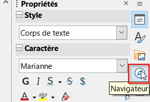
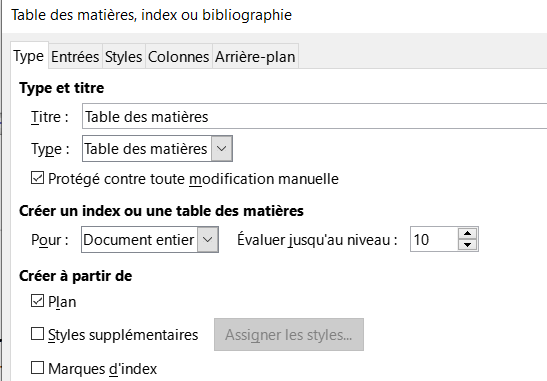
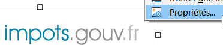
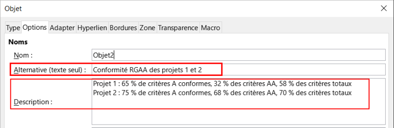
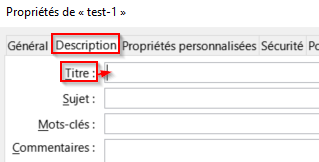
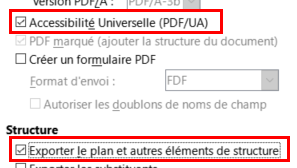
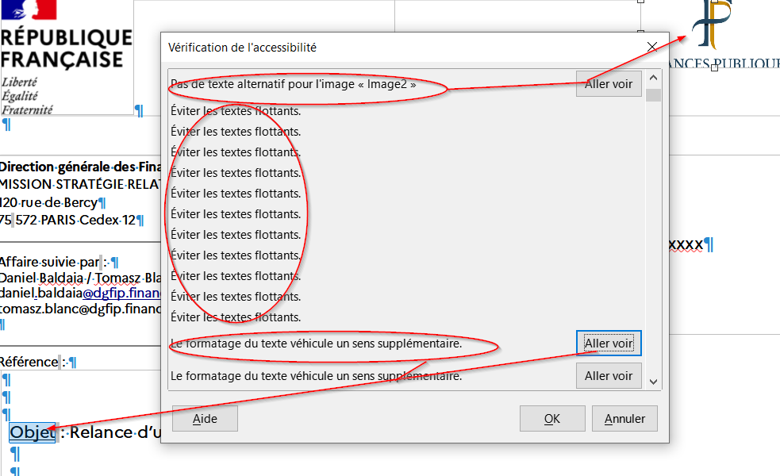
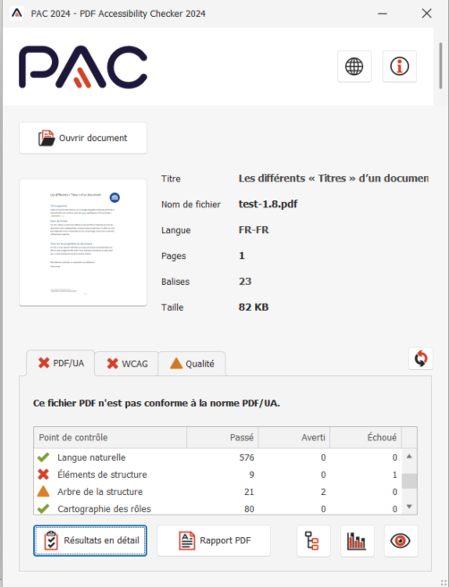

<!-- Adresse du site imprimée d'un seul tenant : pas de césure, pas de retour à la ligne. -->

<!-- La page de garde présente les cinq étapes du parcours. Le sous-titre est
     compact pour conserver le bandeau, le titre et la liste sur une seule page. -->

# Mémo accessibilité - LibreOffice Writer

Mode opératoire complémentaire pour Writer sous Windows. Les identifiants
renvoient à la checklist et au guide Sami. Les libellés peuvent varier selon la
version installée ; les chemins sont à confirmer pendant la recette Windows.

## Étape 1 - Structurer et naviguer

### P-01 - Distinguer le titre principal des titres hiérarchiques

**Procédure Writer** : **Styles** > **Gérer les styles**. Appliquer **Titre** au
titre principal, puis **Titre 1**, **Titre 2** et les niveaux suivants aux
sections.

### P-02 - Construire une hiérarchie cohérente

**Procédure Writer** : **Affichage** > **Navigateur**, puis corriger les styles
depuis **Styles** > **Gérer les styles**. Les niveaux progressent sans saut.

### P-03 - Naviguer et générer un sommaire automatique

**Procédure Writer** : **Insertion** > **Table des matières et index** > **Table
des matières, index ou bibliographie**. Après une modification, clic droit dans
le sommaire > **Actualiser la table des matières**.

### P-04 - Utiliser des listes natives

**Procédure Writer** : sélectionner les paragraphes, puis **Format** > **Puces
et numérotation**. Ne pas saisir les puces, numéros ou retraits au clavier.

### P-05 - Employer les fonctions de mise en page adaptées

**Procédure Writer** : **Affichage** > **Marques de formatage**, puis corriger
les espacements dans **Format** > **Paragraphe**. Utiliser les sauts et le style
de page au lieu de paragraphes vides, tabulations ou espaces répétés.

## Étape 2 - Rendre les contenus et les liens compréhensibles

### P-06 - Rédiger l'alternative d'une image informative simple

**Procédure Writer** : clic droit sur l'image > **Propriétés** > **Options**,
puis renseigner le texte alternatif avec l'information utile.

### P-07 - Décrire une image complexe

**Procédure Writer** : renseigner une alternative courte dans les propriétés,
puis ajouter la description détaillée dans le corps. La description doit rester
compréhensible quand l'image est masquée.

### P-08 - Marquer une image redondante comme décorative

**Procédure Writer** : si l'option **Décoratif** existe selon la version
installée, l'activer. Sinon, laisser le titre et la description vides seulement
après avoir vérifié que l'image ne porte aucune information absente du texte.

### P-09 - Remplacer une image de texte par du vrai texte

**Procédure Writer** : saisir l'information dans le corps, appliquer les styles
utiles, puis supprimer l'image de texte. Le contenu doit pouvoir être
sélectionné, agrandi et recherché.

### P-10 - Rendre les liens autonomes et identifiables

**Procédure Writer** : clic droit > **Modifier l'hyperlien**, puis remplacer
« cliquez ici » par un libellé qui décrit la destination. Pour un
téléchargement, indiquer le titre, le format, le poids et la langue si elle
diffère de celle du document.

### P-11 - Reprendre une information essentielle dans le corps

**Procédure Writer** : ajouter le statut dans le corps avec un style adapté et
traiter l'arrière-plan séparément. Un filigrane éventuel ne doit jamais être
l'unique porteur de l'information.

## Étape 3 - Sécuriser les couleurs, les graphiques et les tableaux

### P-12 - Mesurer les contrastes utiles

**Procédure Writer** : relever les couleurs du caractère et de l'arrière-plan,
les mesurer avec Colour Contrast Analyser, puis corriger la couleur du caractère
si nécessaire.

**Seuils** : au moins **4,5:1** pour le texte normal, **3:1** pour le grand
texte et **3:1** pour les composants graphiques utiles. Toujours conclure à
partir du ratio calculé, jamais de l'apparence ou d'un code couleur isolé.

### P-13 - Ne pas transmettre une information par la couleur seule

**Procédure Writer** : **Insertion** > **Diagramme**, reporter les valeurs,
afficher les étiquettes et choisir des remplissages distincts. La correction
reste réalisable dans Writer, sans logiciel d'image.

### P-14 - Structurer un tableau de données simple

**Procédure Writer** : **Tableau** > **Propriétés** pour simplifier la grille,
répéter les premières lignes et éviter le fractionnement. Scinder un tableau
trop complexe plutôt que multiplier les fusions.

## Étape 4 - Régler les langues et la lisibilité

### P-15 - Définir les langues du document et des passages

**Procédure Writer** : **Outils** > **Langue** pour tout le texte, puis choisir
la langue du caractère pour chaque passage dans une autre langue.

### P-16 - Régler une typographie lisible par les styles

**Procédure Writer** : **Styles** > **Gérer les styles** > modifier **Style de
paragraphe par défaut**. Utiliser une police sans sérif, un corps d'au moins 12
points, un interligne de 1,15 et un alignement à gauche.

### P-17 - Appliquer la casse par la mise en forme

**Procédure Writer** : corriger d'abord le texte avec ses accents, puis utiliser
**Format** > **Caractère** > **Effets de caractères** > **Majuscules** si cette
apparence est nécessaire.

### P-18 - Développer les sigles et vérifier les majuscules

**Procédure Writer** : développer le terme à sa première occurrence. Dans
**Outils** > **Options** > **Paramètres linguistiques** > **Linguistique**,
vérifier les options de contrôle des mots en majuscules.

## Étape 5 - Finaliser, vérifier, exporter et contrôler

### P-19 - Renseigner les propriétés et le nom du fichier

**Procédure Writer** : **Fichier** > **Propriétés**, puis **Fichier** >
**Enregistrer sous**. Vérifier le titre, l'auteur, la langue et un nom de fichier
descriptif.

### P-20 - Exporter un PDF structuré

**Procédure Writer** : vérifier les propriétés, puis **Fichier** > **Exporter
vers** > **Exporter au format PDF**. Activer **Accessibilité universelle
(PDF/UA)**, le PDF balisé et l'export des repères ou signets.

### C-01 - Utiliser le vérificateur d'accessibilité

**Procédure Writer** : **Outils** > **Vérification de l'accessibilité**.
Parcourir les résultats, traiter les alertes pertinentes et vérifier
manuellement les points non couverts. Une absence d'erreur ne prouve pas à elle
seule l'accessibilité.

### C-02 - Contrôler le PDF après export

Ouvrir le PDF dans **PAC**, outil principal, ou dans **Acrobat Pro** en
alternative. Contrôler au minimum le titre, la langue, les balises, les signets
et l'ordre de lecture, puis terminer par la **checklist humaine**.

## Point spécifique Writer

Pour préserver l'ordre de lecture, préférer l'ancrage **Comme caractère** pour
les images lorsque leur position doit suivre le texte. Vérifier ce comportement
sur la version installée pendant la recette Windows.

## Ressources

- **Colour Contrast Analyser** : <https://www.tpgi.com/color-contrast-checker/>
- **PAC - PDF Accessibility Checker** : <https://pac.pdf-accessibility.org/>
- **Site d'entraînement** :\
  [https://alexandra-guiderdoni.github.io/tp-fabrication-igpde-102846-ay11/](https://alexandra-guiderdoni.github.io/tp-fabrication-igpde-102846-ay11/){.url-imprimee}
