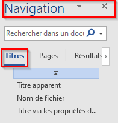
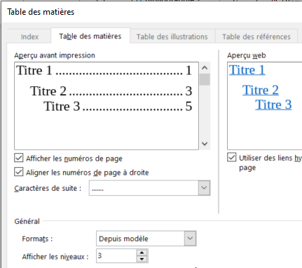
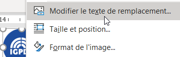
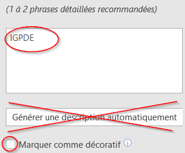
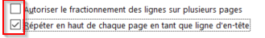
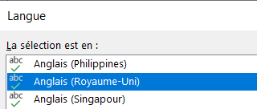
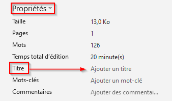
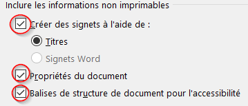
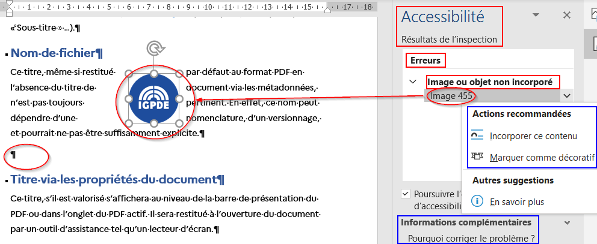

<!-- Adresse du site imprimée d'un seul tenant : pas de césure, pas de retour à la ligne. -->

<!-- La page de garde présente les cinq étapes du parcours. Le sous-titre est
     compact pour conserver le bandeau, le titre et la liste sur une seule page. -->

# Mémo accessibilité - Microsoft Word

Mode opératoire principal pour Word bureau sous Windows. Les identifiants
renvoient à la checklist et au guide Sami. Le guide explique les règles et les
impacts ; ce mémo indique où agir et quoi vérifier.

## Étape 1 - Structurer et naviguer

### P-01 - Distinguer le titre principal des titres hiérarchiques

**Procédure Word** : **Accueil** > **Styles**. Appliquer **Titre** au titre
principal, puis **Titre 1**, **Titre 2** et les niveaux suivants aux sections.

### P-02 - Construire une hiérarchie cohérente

**Procédure Word** : **Affichage** > **Volet de navigation**, puis corriger les
styles depuis **Accueil** > **Styles**. Les niveaux progressent sans saut.

### P-03 - Naviguer et générer un sommaire automatique

**Procédure Word** : **Références** > **Table des matières** > **Table
automatique**. Après une modification, clic droit dans le sommaire > **Mettre à
jour les champs**.

### P-04 - Utiliser des listes natives

**Procédure Word** : sélectionner les paragraphes, puis **Accueil** > **Puces**
ou **Numérotation**. Ne pas saisir les puces, numéros ou retraits au clavier.

### P-05 - Employer les fonctions de mise en page adaptées

**Procédure Word** : **Accueil** > **Afficher tout**, puis corriger les
espacements dans **Paragraphe**. Utiliser **Mise en page** > **Sauts** et
**Mise en page** > **Colonnes** au lieu de paragraphes vides, tabulations ou
espaces répétés.

## Étape 2 - Rendre les contenus et les liens compréhensibles

### P-06 - Rédiger l'alternative d'une image informative simple

**Procédure Word** : clic droit sur l'image > **Afficher le texte de
remplacement**, puis décrire brièvement l'information utile. Vérifier la
description proposée automatiquement au lieu de la valider par défaut.

### P-07 - Décrire une image complexe

**Procédure Word** : ajouter une alternative courte, puis saisir la description
détaillée dans un paragraphe voisin. La description doit rester compréhensible
quand l'image est masquée.

### P-08 - Marquer une image redondante comme décorative

**Procédure Word** : afficher le texte de remplacement, puis cocher **Marquer
comme décoratif** seulement si l'image ne porte aucune information absente du
texte voisin.

### P-09 - Remplacer une image de texte par du vrai texte

**Procédure Word** : saisir l'information dans un paragraphe structuré,
appliquer les styles utiles, puis supprimer l'image de texte. Le contenu doit
pouvoir être sélectionné, agrandi et recherché.

### P-10 - Rendre les liens autonomes et identifiables

**Procédure Word** : clic droit > **Modifier le lien**, puis remplacer
« cliquez ici » par un libellé qui décrit la destination. Pour un
téléchargement, indiquer le titre, le format, le poids et la langue si elle
diffère de celle du document.

### P-11 - Reprendre une information essentielle dans le corps

**Procédure Word** : ajouter le statut dans le corps avec un style adapté. Un
filigrane ou un élément d'en-tête éventuel ne doit jamais être l'unique porteur
de l'information.

## Étape 3 - Sécuriser les couleurs, les graphiques et les tableaux

### P-12 - Mesurer les contrastes utiles

**Procédure Word** : relever les couleurs du texte et du fond, les mesurer avec
Colour Contrast Analyser, puis corriger la couleur du texte si nécessaire.

**Seuils** : au moins **4,5:1** pour le texte normal, **3:1** pour le grand
texte et **3:1** pour les composants graphiques utiles. Toujours conclure à
partir du ratio calculé, jamais de l'apparence ou d'un code couleur isolé.

### P-13 - Ne pas transmettre une information par la couleur seule

**Procédure Word** : **Insertion** > **Graphique** > **Histogramme groupé**,
reporter les valeurs, afficher les étiquettes et appliquer des motifs distincts.
La correction reste réalisable dans Word, sans logiciel d'image.

### P-14 - Structurer un tableau de données simple

**Procédure Word** : utiliser **Outils de tableau** > **Disposition** pour
défusionner si nécessaire. Dans **Propriétés du tableau**, répéter la ligne
d'en-tête et interdire le fractionnement des lignes. Scinder un tableau trop
complexe plutôt que multiplier les fusions.

## Étape 4 - Régler les langues et la lisibilité

### P-15 - Définir les langues du document et des passages

**Procédure Word** : **Révision** > **Langue** > **Définir la langue de
vérification** pour le document, puis recommencer sur chaque passage dans une
autre langue.

### P-16 - Régler une typographie lisible par les styles

**Procédure Word** : **Accueil** > **Styles** > modifier le style **Normal**.
Utiliser une police sans sérif, un corps d'au moins 12 points, un interligne de
1,15 et un alignement à gauche.

### P-17 - Appliquer la casse par la mise en forme

**Procédure Word** : corriger d'abord le texte avec ses accents, puis utiliser
**Police** > **Effets** > **Majuscules** si cette apparence est nécessaire.

### P-18 - Développer les sigles et vérifier les majuscules

**Procédure Word** : développer le terme à sa première occurrence. Dans
**Fichier** > **Options** > **Vérification**, décocher **Ignorer les mots en
MAJUSCULES** pour que le correcteur les examine.

## Étape 5 - Finaliser, vérifier, exporter et contrôler

### P-19 - Renseigner les propriétés et le nom du fichier

**Procédure Word** : **Fichier** > **Informations** > **Propriétés** >
**Propriétés avancées**, puis **Fichier** > **Enregistrer sous**. Vérifier le
titre, l'auteur, la langue et un nom de fichier descriptif.

### P-20 - Exporter un PDF structuré

**Procédure Word** : vérifier les propriétés, puis **Fichier** > **Enregistrer
sous** ou **Exporter** > **PDF** > **Options**. Activer les propriétés du
document, les balises de structure et les signets issus des titres.

### C-01 - Utiliser le vérificateur d'accessibilité

**Procédure Word** : **Révision** > **Vérifier l'accessibilité**. Parcourir
chaque résultat, traiter les alertes pertinentes et expliquer les alertes
résiduelles. Une absence d'erreur ne prouve pas à elle seule l'accessibilité.

### C-02 - Contrôler le PDF après export

Ouvrir le PDF dans **PAC**, outil principal, ou dans **Acrobat Pro** en
alternative. Contrôler au minimum le titre, la langue, les balises, les signets
et l'ordre de lecture, puis terminer par la **checklist humaine**.

## Ressources

- **Colour Contrast Analyser** : <https://www.tpgi.com/color-contrast-checker/>
- **PAC - PDF Accessibility Checker** : <https://pac.pdf-accessibility.org/>
- **Site d'entraînement** :\
  [https://alexandra-guiderdoni.github.io/tp-fabrication-igpde-102846-ay11/](https://alexandra-guiderdoni.github.io/tp-fabrication-igpde-102846-ay11/){.url-imprimee}
